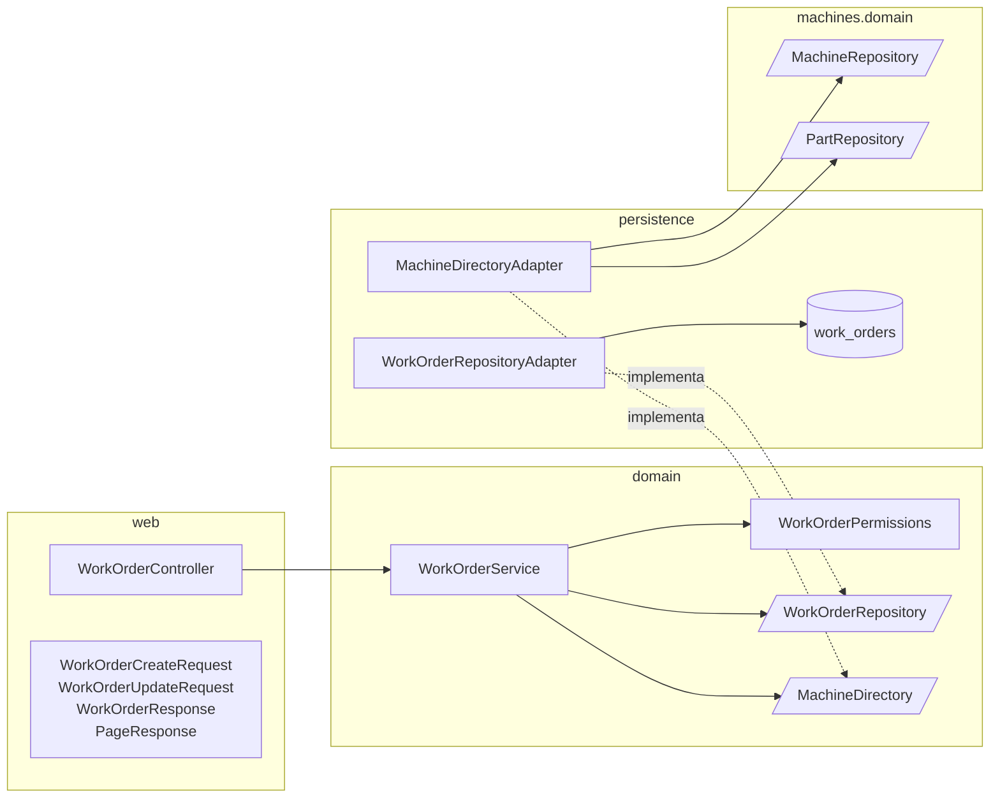
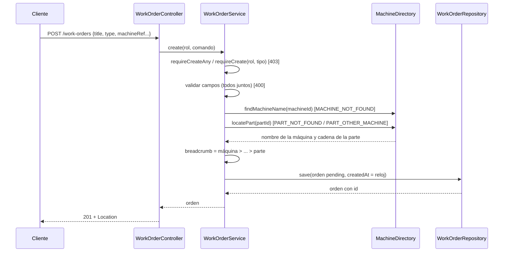

# Spec 03 — Diseño: órdenes de trabajo (alta, consulta, edición, baja y listado)

## 1. Decisiones técnicas

| Tema | Decisión | Motivo |
|---|---|---|
| Módulo | `workorders` con `web / domain / persistence`, más `shared/domain` (paginación e ids) y `shared/web` (`PageResponse`) | Organización vertical por feature (`CLAUDE.md`); `steering/tech.md` anotaba que a `shared` le faltaba la paginación |
| Autorización | `WorkOrderPermissions` en `domain` (`requireView`, `requireCreateAny`, `requireCreate(rol, tipo)`, `requireEdit`, `requireDelete`) sobre `AccessPolicy`. El controller solo extrae el rol del `Jwt` | Regla del proyecto; espejo de `work-order.permissions.ts` |
| Validación de entrada | En `domain`, después de autorizar. Los request son records/clases planas de `String`, sin Bean Validation; **también los parámetros de consulta** (`page`, `size`, `status`, `priority` llegan como `String`) | Fija el orden de REQ-46. Con `@RequestParam int page` un `abc` caería en `MethodArgumentTypeMismatchException` y hoy eso termina en el `500` genérico; REQ-3 pide `400 VALIDATION_ERROR` |
| Orden de errores | REQ-46: `401 → 403 → 400 formato → 404 → 400 referencia`. En el alta el `403` se decide en dos pasos: primero "el rol no crea ningún tipo" y, si el `type` enviado es válido, "ese rol no lo crea" (§4.2) | El permiso del alta depende del cuerpo, pero `403` tiene que ganar a `400` (`steering/tech.md`) |
| Enums | `WorkOrderType`, `Priority`, `WorkOrderStatus` con `toValue`/`fromValue` (coincidencia exacta, kebab-case), como `TeamType` | Patrón existente |
| Referencias a máquina y parte | Puerto `MachineDirectory` en `workorders/domain`; su adaptador vive en `workorders/persistence` y se apoya en los **puertos públicos** `MachineRepository` y `PartRepository` de `machines/domain` (no en sus entities) | El servicio necesita el nombre de la máquina y la cadena de ancestros de una parte para el `breadcrumb` (REQ-23, REQ-24). Acoplar solo puertos evita un ciclo de persistencia entre módulos |
| Snapshot | `breadcrumb` (`TEXT`), `takenBy.name` y `closingNote.authorName` se guardan como texto en la orden, sin relación viva con `machines`, `parts` ni `users` | REQ-29 y REQ-30: la orden conserva lo que tenía; ROADMAP D3 |
| Sin FK a `machines` ni `parts` | `work_orders.machine_id` y `part_id` son columnas sueltas | REQ-30 (decisión de contexto) |
| FK a `users` | `taken_by_id` y `closing_author_id` referencian `users(id)`, sin cascada | El dueño y el autor de cierre son usuarios reales; ROADMAP D5. La spec 04 los escribe |
| Listado | `JpaSpecificationExecutor` con una `Specification` que suma `title`, `status` y `priority` solo si vienen; `PageRequest.of(page - 1, size, Sort.by("id"))` | Una sola consulta de datos y una de conteo, sin armar JPQL con parámetros nulos (Postgres no infiere el tipo de `lower(null)`) |
| Búsqueda por título | `lower(title) like lower(:texto) escape '\'` con `%` y `_` y `\` escapados en Java (REQ-7); el texto se recorta antes (REQ-6, REQ-8) | Literal, sin comodines |
| Fuera de rango | Spring Data devuelve `content` vacío con `totalElements` real cuando `page > totalPages` | REQ-4 sin lógica extra; el `totalPages` de una lista vacía es `0` (REQ-5) |
| Reloj | Bean `Clock` (`shared/config/ClockConfig`) inyectado en el servicio; `createdAt` se trunca a milisegundos | `Instant.now()` directo no se puede testear; los milisegundos coinciden con los `.000Z` de `db.json` y con `Instant` de JavaScript |
| Ids | `BIGSERIAL` en la base, `string` en la API. Un id de URL que no es un número de hasta 18 dígitos es un recurso inexistente (`404`). **El parseo pasa a `shared/domain/NumericId`** y `machines` lo usa en lugar de su `MachineIds` | Mismo criterio que equipos y máquinas (REQ-14, REQ-37, REQ-40); evita duplicar el helper |
| Lo que fija el servidor | `id`, `status`, `createdAt`, `takenBy`, `closingNote` y `breadcrumb` en el cuerpo **se ignoran** porque los request no tienen esos campos y Jackson descarta las propiedades desconocidas (default de Boot) | REQ-31 sin código |
| `PUT`: qué se compara | `type` y `machineRef.machineId`/`comment`: un valor `null` o ausente se ignora. `machineRef.partId`: se distingue ausente de `null` enviado (setter que marca "enviado"), porque `null` es un valor válido | Mismo problema que `parentId` del `PATCH` de la spec 02: `partId: null` enviado a una orden con parte es un intento de cambiarla |
| Mapeo | Mappers manuales en `persistence`, `from(...)` estático en los `Response` | Igual que las specs anteriores |
| Errores | Las cuatro excepciones genéricas de `shared/domain`; **sin cambios en `RestExceptionHandler`** | Los `code` (`MACHINE_NOT_FOUND`, `PART_NOT_FOUND`, `PART_OTHER_MACHINE`) son datos |
| OpenAPI | `@Tag`, `@Operation`, `@Parameter`, `@ApiResponse` y `@SecurityRequirement(bearerAuth)` | REQ-45; sin config nueva |

## 2. Modelo de datos y migraciones

### 2.1 Esquema

```sql
-- V7__work_orders_schema.sql  (db/migration)
CREATE TABLE work_orders (
    id                   BIGSERIAL     PRIMARY KEY,
    title                VARCHAR(150)  NOT NULL,
    description          VARCHAR(2000) NOT NULL,
    machine_id           BIGINT        NOT NULL,              -- sin FK (REQ-30)
    part_id              BIGINT,                              -- sin FK (REQ-30)
    breadcrumb           TEXT          NOT NULL,
    machine_comment      VARCHAR(200)  NOT NULL DEFAULT '',
    type                 VARCHAR(20)   NOT NULL,
    priority             VARCHAR(10)   NOT NULL,
    status               VARCHAR(20)   NOT NULL,
    created_at           TIMESTAMPTZ   NOT NULL,
    taken_by_id          BIGINT        REFERENCES users (id),
    taken_by_name        VARCHAR(100),
    taken_at             TIMESTAMPTZ,
    closing_comment      VARCHAR(500),
    closing_author_id    BIGINT        REFERENCES users (id),
    closing_author_name  VARCHAR(100),
    closed_at            TIMESTAMPTZ,
    CONSTRAINT work_orders_type_check     CHECK (type IN ('preventivo', 'correctivo', 'pronto-intervencion')),
    CONSTRAINT work_orders_priority_check CHECK (priority IN ('low', 'medium', 'high')),
    CONSTRAINT work_orders_status_check   CHECK (status IN ('pending', 'in-progress', 'completed', 'cancelled'))
);
```

- **`takenBy` y `closingNote`** viven como columnas planas con `NULL` cuando no hay dueño o nota; el mapper arma los objetos solo si `taken_by_id` / `closing_author_id` no son nulos. La spec 03 solo los lee (y los carga el seed); los escribe la spec 04.
- `breadcrumb` es `TEXT` porque el árbol de partes no tiene profundidad máxima y cada nombre puede tener hasta 100 caracteres.
- **Sin índices adicionales** a la clave primaria: el listado ordena por `id` y el volumen es bajo. Los índices por `status`/`priority` quedan para la spec 06 (ROADMAP).
- **Sin `CHECK` de invariantes** (pendiente sin dueño, cerrada con nota): son reglas del flujo de estados y las define la spec 04 junto con las transiciones que las mantienen. REQ-43 pide solo limitar `type`, `priority` y `status`.

### 2.2 Seed de dev (REQ-44) y numeración

| Perfil | Migraciones que corren, en orden |
|---|---|
| `dev` | `V1` … `V6` → `V6_1` (máquinas) → **`V7`** → **`V7_1` (seed)** |
| resto de los perfiles | `V1` … `V7` (sin filas) |

- `db/seed/V7_1__seed_work_orders.sql` se carga solo en `dev` (`db/seed` ya está en `spring.flyway.locations` de ese perfil). Va después de `V6_1` porque las órdenes referencian los ids de máquinas y partes de ese seed, y después de `V4_1` por los usuarios.
- **Se genera con un script a partir de `db.json`** (no se tipea a mano): un script de una sola vez, fuera del repo, lee `work-orders` y emite el `INSERT`. Reglas del script, que son REQ-44:
  - ids `1` a `29` tal cual; las tres órdenes de id alfanumérico, en el orden de `db.json`, pasan a `30`, `31` y `32`;
  - `created_at` sin zona (`2026-08-01T10:30:00`) se emite como `'2026-08-01T10:30:00Z'`; `taken_at` y `closed_at` ya traen `Z`;
  - `takenBy.id` y `closingNote.authorId` del frontend (`'2'`, `'5'`) se resuelven a los usuarios del backend por `username` (`tecnico`, `electricista`) con un subselect `(SELECT id FROM users WHERE username = 'tecnico')`; los nombres se copian de `db.json`. Si faltara el usuario, el subselect da `NULL` y una orden `in-progress` quedaría sin dueño: el script emite un `SELECT` de verificación al final que falla la migración si hay una orden no `pending` con `taken_by_id` nulo (se prefiere un arranque roto a un seed a medias);
  - las comillas simples de los textos se duplican.
- El `setval` del final deja la próxima orden en `33`, como en la spec 02:

  ```sql
  SELECT setval(pg_get_serial_sequence('work_orders', 'id'), (SELECT MAX(id) FROM work_orders));
  ```

- Se verificó contra `db.json` (2026-09-30): 32 órdenes (12 `pending`, 9 `in-progress`, 9 `completed`, 2 `cancelled`), todos los `machineId`/`partId` existen, sus `breadcrumb` coinciden con el árbol de la spec 02, y dueño y nota de cierre son coherentes con el estado. El test de seed (§7) lo vuelve a afirmar.
- **Numeración:** esta spec toma `V7` y `V7_1`. La spec 04 no necesita migrar el esquema (las columnas de `takenBy` y `closingNote` ya están); si necesita algo, desde `V8`.

### 2.3 Impacto sobre lo ya construido

- **`MachineIds` (spec 02) se reemplaza por `shared/domain/NumericId`.** `MachineService` y `PartService` cambian solo la llamada. `MachineServiceTest` y `PartServiceTest` siguen siendo la red de seguridad.
- `RestExceptionHandler`, `SecurityConfig` y CORS no cambian. `machines` y `maintenance` no saben de órdenes (REQ-30).
- `OpenApiIT` se amplía.

## 3. Componentes por capa



```
com.enterpriselab.api
├── shared/domain/        PageQuery, PageResult, NumericId   (+ las 4 excepciones ya existentes)
├── shared/web/           PageResponse
├── shared/config/        ClockConfig
├── shared/persistence/   ConstraintViolations (ya existente; sin uso nuevo)
└── workorders/
    ├── web/              WorkOrderController, WorkOrderCreateRequest, WorkOrderUpdateRequest,
    │                     MachineRefRequest, MachineRefPatch, WorkOrderResponse,
    │                     MachineRefResponse, TakenByResponse, ClosingNoteResponse
    ├── domain/           WorkOrder, MachineRef, TakenBy, ClosingNote,
    │                     WorkOrderType, Priority, WorkOrderStatus,
    │                     CreateWorkOrderCommand, UpdateWorkOrderCommand, WorkOrderQuery, WorkOrderFilter,
    │                     WorkOrderService, WorkOrderPermissions,
    │                     WorkOrderRepository, MachineDirectory, PartLocation (puertos)
    └── persistence/      WorkOrderEntity, WorkOrderJpaRepository, WorkOrderSpecifications (paquete-privados),
                          WorkOrderRepositoryAdapter, WorkOrderMapper, MachineDirectoryAdapter
```

**Dominio**

- `WorkOrder(Long id, String title, String description, MachineRef machineRef, WorkOrderType type, Priority priority, WorkOrderStatus status, Instant createdAt, TakenBy takenBy, ClosingNote closingNote)`; `MachineRef(long machineId, Long partId, String breadcrumb, String comment)`; `TakenBy(long userId, String name, Instant at)`; `ClosingNote(String comment, long authorId, String authorName, Instant at)`. Records sin anotaciones de JPA. La spec 04 los reutiliza sin cambios.
- `CreateWorkOrderCommand(title, description, type, priority, machineId, partId, comment, boolean machineRefSent)` y `UpdateWorkOrderCommand(title, description, priority, type, machineId, partIdSent, partId, comment)`: la entrada cruda del controller, todo `String`. `WorkOrderQuery(page, size, title, status, priority)`: la consulta cruda. `WorkOrderFilter(String titleText, WorkOrderStatus status, Priority priority)`: la consulta ya validada (`titleText` nulo si no se filtra).
- `WorkOrderPermissions`, espejo de `work-order.permissions.ts`:

  | Método | Roles | Se usa en |
  |---|---|---|
  | `requireView` | los cuatro | listado y consulta |
  | `requireCreateAny` | `TEAM_LEADER_MANTENIMIENTO`, `PERSONAL_PRODUCCION` | primer `403` del alta |
  | `requireCreate(rol, tipo)` | team leader → `preventivo`, `correctivo`; producción → `pronto-intervencion` | segundo `403` del alta |
  | `requireEdit` | `ADMINISTRADOR`, `TEAM_LEADER_MANTENIMIENTO` | `PUT` |
  | `requireDelete` | `ADMINISTRADOR` | `DELETE` |

- Puertos:

  ```java
  interface WorkOrderRepository {
      PageResult<WorkOrder> search(WorkOrderFilter filter, PageQuery page);
      Optional<WorkOrder> findById(long id);
      WorkOrder save(WorkOrder order);     // alta (id null) o edición de título, descripción y prioridad
      void deleteById(long id);
  }
  interface MachineDirectory {
      Optional<String> findMachineName(long machineId);
      Optional<PartLocation> locatePart(long partId);   // PartLocation(long machineId, List<String> pathNames)
  }
  ```

**Persistencia**

- `WorkOrderEntity` mapea las columnas planas del §2.1; `updateDetails(title, description, priority)` es el único mutador (la spec 04 sumará los de estado).
- `WorkOrderSpecifications` arma el `Specification` (§4.3) y `WorkOrderRepositoryAdapter.search` lo ejecuta con `PageRequest.of(page - 1, size, Sort.by("id"))`. El `id` ordena numéricamente porque es `BIGINT`.
- `MachineDirectoryAdapter.locatePart` hace dos lecturas: `PartRepository.findById(partId)` y, con la `machineId` de esa parte, `PartRepository.findByMachineId(...)`; arma el mapa por id y sube por `parentId` hasta la raíz. No hay riesgo de ciclo (spec 02, REQ-25 y la FK compuesta); igual la subida se corta a un máximo de iteraciones igual al tamaño del mapa, por si alguien toca la base a mano.
- Adaptadores `@Transactional` (con `readOnly` en las lecturas); los servicios de dominio no abren transacciones.
- No hay traducción de constraints: sin FK hacia `machines` ni `parts` ninguna escritura de esta spec puede fallar por una referencia, y `type`/`priority`/`status` los valida el dominio antes (un `CHECK` violado es un bug y responde `500`).

**Web**

- `WorkOrderController` (`/work-orders`) es fino: `AuthenticatedRole.from(jwt)` + delegar + mapear. `GET /work-orders` recibe `page`, `size`, `title`, `status` y `priority` como `@RequestParam(required = false) String`.
- `WorkOrderCreateRequest(title, description, type, priority, MachineRefRequest machineRef)` con `MachineRefRequest(machineId, partId, comment)`: records. `WorkOrderUpdateRequest(title, description, priority, type, MachineRefPatch machineRef)` es una clase; `MachineRefPatch` tiene los setters que marcan si `partId` vino (§1).
- `WorkOrderResponse(id, title, description, machineRef, type, priority, status, createdAt, takenBy, closingNote)`: `id` como string, enums en kebab-case, `createdAt` como `Instant` (ISO-8601 con `Z`). `takenBy` y `machineRef.partId` se serializan como `null` explícito (REQ-15, REQ-23); `closingNote` lleva `@JsonInclude(NON_NULL)` a nivel de propiedad para que **falte** cuando no hay nota.
- `PageResponse<T>(List<T> data, int page, int size, long totalItems, int totalPages)` en `shared/web`, con `from(PageResult<T>, Function<T,R>)`.
- `POST` responde `201` con `Location: /work-orders/{id}`.

## 4. Reglas de dominio

### 4.1 Orden de evaluación (REQ-46)

| # | Paso | Falla con |
|---|---|---|
| 1 | Token válido | `401` (filtro de seguridad) |
| 2 | Rol permitido para la operación; en el alta, además, tipo creable por el rol (solo si el `type` es válido) | `403` |
| 3 | Formato de los campos y de los parámetros, **todos los errores juntos** en `details` | `400 VALIDATION_ERROR` |
| 4 | Existencia de la orden de la URL | `404 NOT_FOUND` |
| 5 | Referencias: máquina y parte del alta; intento de cambiar tipo o máquina en el `PUT` | `400` (`MACHINE_NOT_FOUND`, `PART_NOT_FOUND`, `PART_OTHER_MACHINE`, `VALIDATION_ERROR`) |

Consecuencias: un `PUT` con título inválido sobre una orden inexistente responde `400`, no `404`; un `PUT` que intenta cambiar el tipo de una orden inexistente responde `404`; un `POST` de `administrador` con un cuerpo vacío responde `403`.

### 4.2 `WorkOrderService`

| Operación | Flujo | REQ |
|---|---|---|
| `list(actor, query)` | `requireView` → validar `page`, `size`, `status`, `priority` (todos juntos) → `search` | 1–12, 42, 46 |
| `get(actor, id)` | `requireView` → `NumericId` + `findById` o `NotFoundException` | 13, 14, 42 |
| `create(actor, cmd)` | `requireCreateAny` → si `type` es válido, `requireCreate(actor, type)` → validar todo el comando → resolver referencias → armar la orden → `save` | 15–31, 46 |
| `update(actor, id, cmd)` | `requireEdit` → validar `title`, `description` y `priority` → `findById` (404) → comprobar inmutables (400) → `save` de los tres campos | 32–38, 46 |
| `delete(actor, id)` | `requireDelete` → `findById` (404) → `deleteById` | 39–41 |



Validación del alta (un `Map` campo → mensaje, una sola pasada):

- `title`: `strip()`, de 3 a 150; `description`: `strip()`, de 10 a 2000 (REQ-18, REQ-20). Ausente es el mismo error que vacío.
- `type` (`WorkOrderType.fromValue`) y `priority` (`Priority.fromValue`): obligatorios y exactamente uno de los valores válidos, sin `trim` ni cambio de mayúsculas (REQ-19).
- `machineRef` ausente o con `machineId` nulo: error en `machineRef` / `machineRef.machineId` (REQ-21). Un `machineId` presente pero vacío o no numérico **no** es un error de formato: es `MACHINE_NOT_FOUND` (REQ-22).
- `machineRef.comment`: nulo → `""`; si no, `strip()` y hasta 200 (REQ-27, REQ-28). Las claves de error anidadas se escriben `machineRef.machineId`, `machineRef.comment`.

Resolución de referencias (paso 5, solo si el formato es válido): primero la máquina, después la parte.

1. `machineId` no numérico o sin máquina → `InvalidReferenceException("MACHINE_NOT_FOUND")`.
2. `partId` nulo → `breadcrumb` = nombre de la máquina (REQ-23).
3. `partId` vacío, no numérico o sin parte → `PART_NOT_FOUND` (REQ-25).
4. La parte es de otra máquina → `PART_OTHER_MACHINE` (REQ-26).
5. Si no, `breadcrumb` = nombre de la máquina + `" > "` + los nombres de la cadena de la parte, en ese orden (REQ-24).

Con las dos referencias malas a la vez gana `MACHINE_NOT_FOUND`.

Alta: `status` = `PENDING`, `takenBy` y `closingNote` nulos, `createdAt` = `clock.instant()` truncado a milisegundos (REQ-15, REQ-31). El `breadcrumb` queda guardado como texto y no se recalcula nunca (REQ-29).

Edición (`update`): valida `title`/`description` como el alta y `priority` (REQ-18, REQ-19, REQ-20). Después de encontrar la orden, reúne en un `Map` los intentos de cambio y, si hay alguno, responde `ValidationFailedException` sin guardar (REQ-33, REQ-34):

- `type` enviado y distinto del valor actual (texto exacto) → `type`;
- `machineRef.machineId` enviado y distinto → `machineRef.machineId`;
- `machineRef.partId` enviado (aunque sea `null`) y distinto del actual → `machineRef.partId`;
- `machineRef.comment` enviado y distinto del actual tras `strip()` → `machineRef.comment`.

`id`, `status`, `takenBy`, `closingNote`, `createdAt` y `machineRef.breadcrumb` no están en el request: se ignoran (REQ-35). La edición funciona en cualquier estado y `save` solo toca título, descripción y prioridad, así que estado, dueño y nota de cierre se conservan (REQ-36).

### 4.3 Listado

`list` valida, todo junto (REQ-3, REQ-12):

- `page`: ausente → `1`; si no, entero ≥ 1. `size`: ausente → `10`; si no, entero entre 1 y 100. Se parsean con `Integer.parseInt` dentro de un `try`: un texto no numérico o fuera del rango de `int` es error del parámetro.
- `status` y `priority`: ausentes o vacíos no filtran; si tienen valor, deben ser uno válido (`fromValue` exacto).
- `title`: `strip()`; vacío o nulo → no filtra (REQ-8).

La `Specification` suma un predicado por cada filtro presente y los combina con `AND` (REQ-11):

```java
cb.like(cb.lower(root.get("title")), "%" + escape(text.toLowerCase(Locale.ROOT)) + "%", '\\')
```

`escape` antepone `\` a `\`, `%` y `_` (REQ-7). `totalItems` es la cantidad que cumple los filtros y `totalPages = ceil(totalItems / size)` (REQ-2); con `totalItems = 0`, `totalPages = 0` (REQ-5). Una `page` mayor que `totalPages` devuelve `data` vacío con los totales reales (REQ-4).

## 5. Contrato HTTP

| Método y ruta | Roles | Éxito | Errores propios |
|---|---|---|---|
| `GET /work-orders?page&size&title&status&priority` | los cuatro | `200 PageResponse<WorkOrderResponse>` | `400` parámetros |
| `GET /work-orders/{id}` | los cuatro | `200 WorkOrderResponse` | `404` |
| `POST /work-orders` | team leader (`preventivo`, `correctivo`), producción (`pronto-intervencion`) | `201 WorkOrderResponse` + `Location` | `400` (incluye `MACHINE_NOT_FOUND`, `PART_NOT_FOUND`, `PART_OTHER_MACHINE`) |
| `PUT /work-orders/{id}` | administrador, team leader | `200 WorkOrderResponse` | `400` (incluye cambiar tipo o máquina), `404` |
| `DELETE /work-orders/{id}` | administrador | `204` | `404` |

Todas devuelven `401` sin token y `403` con el rol equivocado, en el `ApiError` de la spec 00. Ejemplo del listado:

```json
{ "data": [ { "id": "1", "title": "…", "description": "…",
              "machineRef": { "machineId": "1", "partId": "3", "breadcrumb": "Envasadora línea 1 > Mesa de transporte > Cinta 1 > Motor de cinta", "comment": "" },
              "type": "preventivo", "priority": "low", "status": "completed",
              "createdAt": "2026-08-03T14:00:00Z",
              "takenBy": { "id": "5", "name": "Técnico Electricista Preventivo", "at": "2026-08-03T15:00:00Z" },
              "closingNote": { "comment": "…", "authorId": "5", "authorName": "Técnico Electricista Preventivo", "at": "2026-08-03T20:00:00Z" } } ],
  "page": 1, "size": 10, "totalItems": 32, "totalPages": 4 }
```

`takenBy.id` y `closingNote.authorId` son ids de usuario del backend, como string.

## 6. Concurrencia e integridad

- **Creación:** la máquina y la parte se leen antes de insertar y pueden borrarse justo después. No hace falta traducir nada: sin FK, la orden se guarda con el `breadcrumb` ya calculado, que es exactamente el caso de REQ-30.
- **Edición y baja:** `PUT` modifica una fila por su `id` y `DELETE` la borra; no hay reglas de integridad que proteger en esta spec. Dos `PUT` simultáneos aplican el último; el control optimista queda fuera de alcance.
- **Borrado concurrente:** un `PUT` sobre una orden que otro `DELETE` ya borró hace fallar el `findById` del adaptador con `NotFoundException` (`404`), no un `500`.
- Cualquier violación de `CHECK` es un error de programación (el dominio valida antes) y sigue el camino normal al `500` sin filtrar detalles.

## 7. Estrategia de pruebas

Las IT extienden `AbstractPostgresIT` con perfil `dev` y los usuarios sembrados (`admin`, `teamleader`, `produccion`, `tecnico`). La base se comparte entre IT: cada test crea sus propias órdenes (título con un prefijo propio, p. ej. `WOCIT-`), sus propias máquinas y partes cuando las necesita, limpia al terminar y no afirma sobre totales sino sobre lo que contiene. **Las 32 órdenes del seed solo se leen.**

| Requisito | Prueba |
|---|---|
| REQ-1 | `WorkOrderControllerIT`: sin parámetros → forma `{data, page, size, totalItems, totalPages}`, `size` 10, `page` 1, ordenado por `id` |
| REQ-2 | `WorkOrderRepositoryAdapterIT` (contra datos propios): `page`/`size`, `totalItems` y `totalPages` con filtros; `WorkOrderControllerIT` |
| REQ-3 | `WorkOrderServiceTest` + `WorkOrderControllerIT`: `page=0`, `size=0`, `size=101`, `page=abc`, `size=1.5`, número fuera de `int`; `400` con detalle del parámetro y todos juntos |
| REQ-4, 5 | `WorkOrderControllerIT`: `page` muy alta → `200` con `data` vacío y totales reales; un filtro sin coincidencias → `totalItems` 0 y `totalPages` 0 |
| REQ-6, 7, 8 | `WorkOrderRepositoryAdapterIT`: sin distinguir mayúsculas, con espacios en los bordes, `%`, `_` y `\` literales, título vacío o en blanco ignorado |
| REQ-9, 10, 11, 12 | `WorkOrderRepositoryAdapterIT` y `WorkOrderControllerIT`: cada filtro, los tres combinados y los totales; valor inválido → `400` y no lista vacía |
| REQ-13, 14 | `WorkOrderControllerIT`: consulta de la orden `3` del seed con `takenBy` y `closingNote`; id inexistente y no numérico → `404` |
| REQ-15 | `WorkOrderControllerIT`: `201` con `id`, `Location`, `pending`, `createdAt` del servidor, `takenBy` `null` y sin `closingNote`; `WorkOrderServiceTest` con un `Clock` fijo |
| REQ-16, 17 | `WorkOrderPermissionsTest` + `WorkOrderServiceTest`: **matriz 4 roles × 3 tipos**; `WorkOrderControllerIT`: `administrador` y `tecnico` reciben `403` y no se crea nada |
| REQ-18, 19, 20 | `WorkOrderServiceTest`: límites 3/150 y 10/2000 (justo dentro y justo fuera, tras recortar), ausentes, tipo y prioridad inválidos, todos los errores juntos; recorte al guardar |
| REQ-21, 22 | `WorkOrderServiceTest` + `WorkOrderControllerIT`: sin `machineRef` y sin `machineId` → `VALIDATION_ERROR`; máquina inexistente, vacía y no numérica → `MACHINE_NOT_FOUND` |
| REQ-23, 24 | `MachineDirectoryAdapterIT` y `WorkOrderControllerIT`: orden sobre la máquina (`breadcrumb` = nombre); sobre una parte de primer nivel, de nivel 3 y de nivel 5 (cadena completa en orden y con ` > `) |
| REQ-25, 26 | `WorkOrderServiceTest` + `WorkOrderControllerIT`: parte inexistente, vacía, no numérica → `PART_NOT_FOUND`; parte de otra máquina → `PART_OTHER_MACHINE`; máquina mala gana a parte mala; nada se crea |
| REQ-27, 28 | `WorkOrderServiceTest`: comentario recortado, ausente → `""`, 200 pasa y 201 falla; el `breadcrumb` no lo incluye |
| REQ-29 | `WorkOrderControllerIT`: crear una orden, renombrar la máquina y las partes de su cadena por la API, y la orden conserva el `breadcrumb` original |
| REQ-30 | `WorkOrderControllerIT`: crear la orden, eliminar la parte (hoja) y la máquina por la API de la spec 02, y la orden conserva su `machineRef` completo |
| REQ-31 | `WorkOrderControllerIT`: `POST` con `id`, `status: completed`, `createdAt`, `takenBy`, `closingNote` y `machineRef.breadcrumb` → se crea `pending`, sin dueño, sin nota, con el `createdAt` del servidor y el `breadcrumb` calculado |
| REQ-32, 36 | `WorkOrderControllerIT`: `PUT` de título, descripción y prioridad en `pending`, `in-progress`, `completed` y `cancelled`; como esta spec no puede cambiar el estado por la API, el test crea órdenes propias y fuerza el estado, el dueño y la nota por SQL; el estado, el dueño y la nota se conservan |
| REQ-33, 34 | `WorkOrderServiceTest` + `WorkOrderControllerIT`: `type`, `machineId`, `partId` (incluido `null` enviado a una orden con parte) y `comment` distintos → `400` con la clave del campo y orden intacta; iguales o ausentes se aceptan; un `PUT` con el objeto completo de la orden se acepta |
| REQ-35 | `WorkOrderControllerIT`: `PUT` con `status`, `takenBy`, `closingNote`, `createdAt`, `id` y `breadcrumb` distintos → se ignoran |
| REQ-37, 40 | `WorkOrderControllerIT`: `PUT` y `DELETE` de un id inexistente o no numérico → `404`, sin altas |
| REQ-38, 41 | `WorkOrderServiceTest` (4 roles × `PUT` y × `DELETE`) + `WorkOrderControllerIT`: `produccion` y `tecnico` reciben `403` en `PUT`; todos menos `administrador` (incluido `teamleader`) reciben `403` en `DELETE` y la orden sigue |
| REQ-39 | `WorkOrderControllerIT`: baja de una orden en cada estado con `204` |
| REQ-42 | `WorkOrderControllerIT`: los cuatro roles reciben `200` en el listado y en la consulta |
| REQ-43 | `WorkOrdersMigrationIT`: columnas, los tres `CHECK` rechazan valores inválidos, `machine_id` y `part_id` aceptan ids inexistentes (sin FK) |
| REQ-44 | `SeedWorkOrdersIT` (perfil `dev`): 32 órdenes con la distribución por estado, ids `1` a `32`, las tres renumeradas, `createdAt` en UTC, dueños y autores de cierre apuntando a `tecnico` y `electricista`, y cada `breadcrumb` igual al que arma el árbol de máquinas y partes; `WorkOrdersUpgradeIT` (base propia): el próximo id es `33`, y sin el seed la tabla queda vacía |
| REQ-45 | `OpenApiIT` (se amplía): `/v3/api-docs` contiene `/work-orders` (`get`, `post`) y `/work-orders/{id}` (`get`, `put`, `delete`) con `bearerAuth`, los parámetros del listado y los `201`, `400`, `404` |
| REQ-46 | `WorkOrderControllerIT`: `403` sobre `400` (`administrador` con cuerpo vacío; team leader con `pronto-intervencion` y otros campos inválidos); `400` de formato sobre `404` (`PUT` inválido a un id inexistente); `404` sobre `400` de cambio de tipo; `400` de formato sobre `400` de referencia; `type` inválido → `400` y no `403` |

Además: `NumericIdTest` (los casos de `MachineServiceTest` de ids inválidos) y `WorkOrderPermissionsTest`. Tests que se tocan de la spec 02: ninguno; `MachineServiceTest` y `PartServiceTest` deben seguir en verde tras el cambio de `MachineIds` a `NumericId`. Todo debe pasar con `./gradlew test`.

## 8. Puntos que decidí yo y reglas que los requisitos no cubren

Decisiones de diseño a confirmar al aprobar:

1. **Los parámetros de consulta se validan en `domain` y llegan como `String`** (§1), para que un `page=abc` sea `400 VALIDATION_ERROR` y no el `500` del `MethodArgumentTypeMismatchException`. Costo: el controller no documenta tipos enteros; se documentan con `@Parameter`.
2. **`MachineDirectory` se apoya en los puertos públicos de `machines/domain`** (§3), no en SQL ni en las entities: acopla los módulos por su contrato y no por sus tablas. La alternativa, una consulta nativa sobre `machines`/`parts`, duplicaría la regla de "qué es el árbol".
3. **`PUT` distingue "ausente" de `null` solo en `machineRef.partId`** (§1), el mismo criterio del `PATCH` de la spec 02.
4. **`NumericId` compartido** reemplaza a `MachineIds` (§2.3).
5. **Se guardan de una vez las columnas de `takenBy` y `closingNote`** aunque esta spec solo las lee: el seed las necesita y evita una migración `V8` solo para agregarlas. Las invariantes entre ellas y el estado quedan para la spec 04.
6. **Sin índices adicionales** (§2.1) hasta la spec 06.
7. **`createdAt` truncado a milisegundos** y `Clock` inyectado (§1).
8. **Un script de una sola vez genera el seed** desde `db.json` (§2.2), con verificación al final del SQL, en vez de tipear 32 filas.

No se agregan requisitos: todo lo que apareció al diseñar ya estaba cubierto por REQ-1 a REQ-46.

## 9. Trazabilidad

| REQ | Sección |
|---|---|
| 1, 2 | §1 (listado, paginación), §3 (`PageResponse`), §4.3, §5 |
| 3 | §1 (validación en `domain`), §4.3 |
| 4, 5 | §1 (fuera de rango), §4.3 |
| 6, 7, 8 | §1 (búsqueda por título), §4.3 |
| 9, 10, 11, 12 | §4.3, §5 |
| 13, 14 | §4.2, §5 |
| 15, 31 | §1 (lo que fija el servidor, reloj), §4.2 |
| 16, 17 | §3 (`WorkOrderPermissions`), §4.1, §4.2 |
| 18, 19, 20 | §4.2 |
| 21, 22 | §4.2 (validación y resolución de referencias) |
| 23, 24 | §3 (`MachineDirectory`), §4.2 |
| 25, 26 | §4.2 |
| 27, 28 | §4.2 |
| 29, 30 | §1 (snapshot, sin FK), §2.1, §6 |
| 32, 33, 34, 35, 36 | §1 (`PUT`), §4.2 |
| 37, 38 | §4.1, §4.2 |
| 39, 40, 41 | §4.2, §5 |
| 42 | §3 (`WorkOrderPermissions`), §4.2 |
| 43 | §2.1 |
| 44 | §2.2 |
| 45 | §1 (OpenAPI), §5 |
| 46 | §1 (orden de errores), §4.1 |
