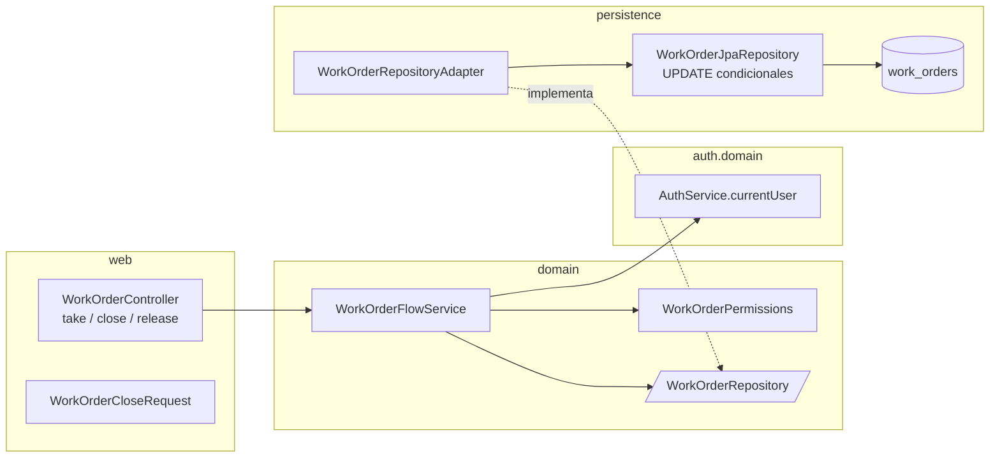
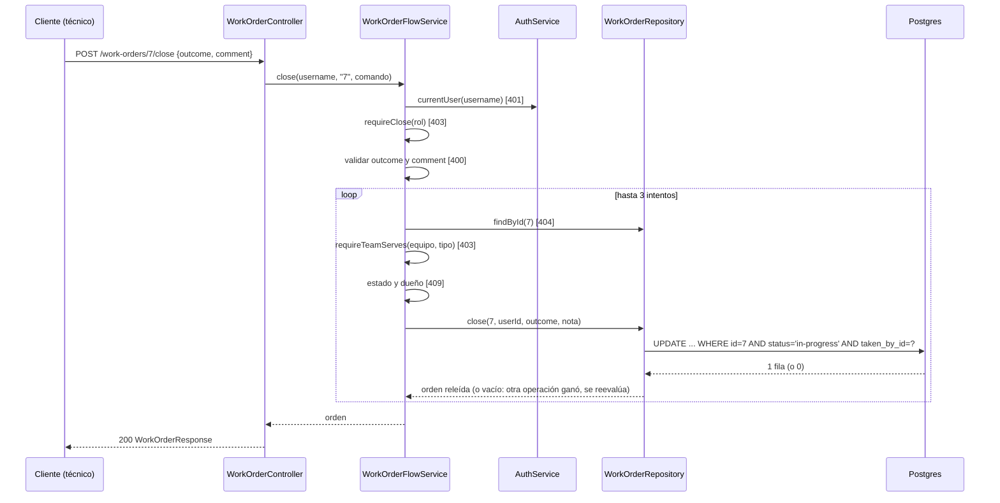

# Spec 04 — Diseño: órdenes de trabajo, tomar, cerrar y liberar

## 1. Decisiones técnicas

| Tema | Decisión | Motivo |
|---|---|---|
| Módulo | Sigue en `workorders` (`web / domain / persistence`). Servicio nuevo `WorkOrderFlowService` en `domain`; `WorkOrderService` (spec 03) no cambia | `WorkOrderService` ya lista, valida y resuelve referencias; las transiciones tienen otras dependencias (usuario actual) y otras reglas. Un solo servicio mezclaría las dos cosas |
| Endpoints | `POST /work-orders/{id}/take`, `/close`, `/release` en el `WorkOrderController` existente | ROADMAP D4, requisitos (contexto) |
| Atomicidad | Cada transición es un `UPDATE ... WHERE id = ? AND status = ? [AND taken_by_id = ?]` que devuelve la cantidad de filas tocadas; el adaptador lo ejecuta y relee la orden **en la misma transacción** | REQ-7, REQ-20, REQ-21. Postgres (READ COMMITTED) bloquea la fila, y el segundo `UPDATE` reevalúa el `WHERE` sobre la fila ya confirmada y toca 0 filas. No hace falta bloqueo explícito ni columna de versión |
| Decisión en `domain` | El servicio lee la orden, decide con reglas de dominio (rol, tipo de equipo, estado, dueño) y **además** pide la actualización condicional. La condición del `UPDATE` repite la del dominio solo para cerrar la ventana entre lectura y escritura | `CLAUDE.md`: la autorización y las reglas viven en `domain`. La base no decide, solo impide que dos decisiones tomadas sobre la misma lectura se apliquen las dos |
| Reintento | Si el `UPDATE` toca 0 filas, el servicio vuelve a leer y decide de nuevo, hasta 3 intentos. Si la relectura ya no cumple la condición, sale el `409` con el estado **real actual**; si aún la cumple (la orden cambió y volvió), reintenta | Sin reintento, la relectura después de un `UPDATE` fallido podría mostrar un estado que sí cumple la condición (liberada y vuelta a tomar por el mismo técnico) y el `409` saldría contradictorio (`NOT_PENDING` con `status` `pending`). Agotar los 3 intentos sin resolver es un error de programación: el servicio lanza `IllegalStateException`, que el manejador genérico de `500` ya responde sin filtrar detalles |
| Usuario actual | `WorkOrderFlowService` recibe el `username` (`jwt.getSubject()`) y llama a `AuthService.currentUser(username)`. Un usuario borrado lanza `UnknownSessionUserException` (`401`, enmienda 00-A REQ-24). El rol que se evalúa es el del usuario leído de la base, no el claim del token | Se necesitan `id`, `displayName` y el tipo de equipo, que no están en el token (REQ-2, REQ-10). Con una sola lectura todo sale de la misma fuente. Es la autoridad que pide el proyecto: un cambio de rol se nota en la próxima acción |
| Tipo de equipo | `User.teamType()` (enmienda 00-A): `UserMapper` ya lo lee de `technicians` por el legajo, nunca del token. Se convierte con `TeamType.fromValue` (`maintenance.domain`) | Cumple "se lee del maestro por el legajo" sin un segundo acceso. `workorders` importa `maintenance.domain.TeamType` y `auth.domain`; ninguno importa a `workorders`, no hay ciclo |
| Reloj y foto | `Clock` inyectado; `at` truncado a milisegundos, como `createdAt`. `takenBy.name` y `closingNote.authorName` son `user.displayName()` copiado | Igual que la spec 03 (REQ-29 y 30 de esa spec) |
| Conflictos | `ConflictException` gana un segundo constructor con `Map<String,String> details`; `RestExceptionHandler.handleConflict` los pasa al `ApiError` (hoy solo lo hace con `VALIDATION_ERROR`). `details` vacío o nulo se omite, así que los `409` de las specs 01 y 02 no cambian | REQ-6, 17, 18, 24. `ApiError.details` ya es `Map<String,String>`: no hace falta otra clase de error |
| `details` | Siempre `status` (valor kebab-case real) y, si la orden tiene dueño, `takenById` y `takenByName`. Un solo ayudante arma el mapa para los tres `code` | Es un superconjunto de lo que piden REQ-17 y REQ-24 (en `completed`/`cancelled` también llega el dueño). Una sola regla en lugar de tres |
| Validación del cierre | Request de `String`, sin Bean Validation, validada en `domain` después de autorizar, todos los errores juntos | Mismo criterio que la spec 03: el `403` tiene que ganar al `400` y el `400` a todo lo demás |
| Mutación en el entity | **`WorkOrderEntity` no cambia: conserva `updatable = false`** en `status`, `taken_*` y `closing_*`, y sin setters. Las escriben solo las consultas `@Modifying` del repositorio JPA (un `UPDATE` JPQL no mira `updatable`). Se agrega un comentario en la entity que explica por qué | Si se quitara, `WorkOrderRepositoryAdapter.save` (el `PUT` de la spec 03 carga la entity y hace `saveAndFlush`) reescribiría **todas** las columnas con lo que leyó: un `PUT` concurrente con un `close` volvería a poner `in-progress` y a borrar la nota, y `V8` lo aceptaría (es una combinación válida). Con `updatable = false` el `PUT` solo escribe título, descripción y prioridad. Una IT (§7) lo prueba |
| Cache de Hibernate | Las consultas `@Modifying` usan `flushAutomatically` y `clearAutomatically` | La relectura de la misma transacción tiene que ver lo escrito, no la entity cacheada |
| Invariantes en la base | Migración `V8` con `CHECK` (§2) | REQ-30. Es la última defensa si un bug del servicio intenta una combinación imposible |
| Errores | Sin handlers nuevos; solo el cambio de `ConflictException` de arriba | Los `code` son datos |
| OpenAPI | `@Operation` y `@ApiResponse` (`200`, `400` en `close`, `403`, `404`, `409`) en los tres métodos | REQ-31 |

## 2. Migración y seed

`V8__work_orders_state_invariants.sql` (en `db/migration`, corre en todos los perfiles):

```sql
ALTER TABLE work_orders
    ADD CONSTRAINT work_orders_owner_group_check CHECK (
        (taken_by_id IS NULL AND taken_by_name IS NULL AND taken_at IS NULL)
        OR (taken_by_id IS NOT NULL AND taken_by_name IS NOT NULL AND taken_at IS NOT NULL)),
    ADD CONSTRAINT work_orders_closing_group_check CHECK (
        (closing_author_id IS NULL AND closing_author_name IS NULL
            AND closing_comment IS NULL AND closed_at IS NULL)
        OR (closing_author_id IS NOT NULL AND closing_author_name IS NOT NULL
            AND closing_comment IS NOT NULL AND closed_at IS NOT NULL)),
    ADD CONSTRAINT work_orders_state_invariants_check CHECK (
        (status = 'pending'     AND taken_by_id IS NULL     AND closing_author_id IS NULL)
     OR (status = 'in-progress' AND taken_by_id IS NOT NULL AND closing_author_id IS NULL)
     OR (status IN ('completed', 'cancelled')
         AND taken_by_id IS NOT NULL AND closing_author_id = taken_by_id));
```

- `work_orders_state_invariants_check` es REQ-30 literal: `pending` sin dueño ni nota, `in-progress` con dueño y sin nota, cerrada con dueño, con nota y con el autor igual al dueño. `closing_author_id = taken_by_id` es falso si alguno es nulo, así que también exige la nota.
- **Los dos `CHECK` de grupo son un agregado mío** (no están en REQ-30): impiden, por ejemplo, un dueño con `taken_at` nulo, que el mapper leería como dueño válido. Se marca en §8.
- **Orden de migración en `dev`:** Flyway ordena por versión: `V7` → `V7_1` (seed) → **`V8`**. Es lo que se quiere: `V8` valida las 32 órdenes sembradas y, si alguna no cumple, el arranque falla.
- **Verificado contra `V7_1` (2026-09-30):** 12 `pending` sin dueño; 9 `in-progress` con dueño (`electricista` o `tecnico`) y sin nota; 11 cerradas (9 `completed` y 2 `cancelled`) cuyo autor de cierre es el mismo usuario que el dueño. Total: 32. `V8` no modifica filas. Una IT lo vuelve a afirmar (§7).
- **Sin cambios de esquema:** las columnas de dueño y nota ya existen (`V7`). No se agregan índices (siguen para la spec 06).

## 3. Componentes por capa



```
com.enterpriselab.api
├── shared/domain/      ConflictException (suma details)
├── shared/web/         RestExceptionHandler (handleConflict pasa details)
└── workorders/
    ├── web/            WorkOrderController (+3 métodos), WorkOrderCloseRequest
    ├── domain/         WorkOrderFlowService, WorkOrderPermissions (+ métodos),
    │                   WorkOrderRepository (+3 operaciones)
    └── persistence/    WorkOrderJpaRepository (+3 @Modifying), WorkOrderRepositoryAdapter,
                        WorkOrderEntity (sin cambios de comportamiento: solo un comentario)
```

**Dominio**

- `WorkOrderPermissions` suma:

  | Método | Regla | Se usa en |
  |---|---|---|
  | `requireTake(rol)` y `requireClose(rol)` | solo `TECNICO` | primer `403` de `take` y `close` |
  | `requireRelease(rol)` | `ADMINISTRADOR`, `TEAM_LEADER_MANTENIMIENTO` | `403` de `release` |
  | `requireTeamServes(TeamType, WorkOrderType)` | `guardia` → `pronto-intervencion`; `preventivo-correctivo` → `preventivo` y `correctivo` | segundo `403` de `take` y `close` |

- Puerto `WorkOrderRepository`, tres operaciones nuevas. Cada una devuelve la orden ya actualizada, o vacío si la condición no se cumplió (0 filas):

  ```java
  Optional<WorkOrder> take(long id, TakenBy owner);            // WHERE status = 'pending'
  Optional<WorkOrder> close(long id, long ownerId,             // WHERE status = 'in-progress'
          WorkOrderStatus outcome, ClosingNote note);          //   AND taken_by_id = :ownerId
  Optional<WorkOrder> release(long id);                        // WHERE status = 'in-progress'
  ```

- `WorkOrderFlowService(AuthService, WorkOrderRepository, Clock)`, métodos `take(username, id)`, `close(username, id, CloseWorkOrderCommand)` y `release(username, id)`. `CloseWorkOrderCommand(String outcome, String comment)` es la entrada cruda del controller.
- Los records de la spec 03 (`WorkOrder`, `TakenBy`, `ClosingNote`) se reutilizan sin cambios.

**Persistencia**

- Tres consultas en `WorkOrderJpaRepository`:

  ```java
  @Modifying(flushAutomatically = true, clearAutomatically = true)
  @Query("update WorkOrderEntity o set o.status = 'in-progress', o.takenById = :userId, "
       + "o.takenByName = :name, o.takenAt = :at where o.id = :id and o.status = 'pending'")
  int take(...);

  @Query("update WorkOrderEntity o set o.status = :outcome, o.closingComment = :comment, "
       + "o.closingAuthorId = :userId, o.closingAuthorName = :name, o.closedAt = :at "
       + "where o.id = :id and o.status = 'in-progress' and o.takenById = :userId")
  int close(...);

  @Query("update WorkOrderEntity o set o.status = 'pending', o.takenById = null, "
       + "o.takenByName = null, o.takenAt = null where o.id = :id and o.status = 'in-progress'")
  int release(...);
  ```

- El adaptador corre cada operación en una transacción: `UPDATE`; si devuelve `0`, `Optional.empty()`; si `1`, `findById` y mapeo. La transacción mantiene el bloqueo de fila hasta el commit, así que la relectura ve lo que escribió.
- `release` no toca las columnas de cierre: una `in-progress` nunca las tiene (lo garantiza `V8`).

**Web**

- `POST /work-orders/{id}/take` y `/release` no leen el cuerpo: lo que mande el cliente (`takenBy`, etc.) no llega a ningún código (REQ-2). `POST /work-orders/{id}/close` recibe `WorkOrderCloseRequest(String outcome, String comment)`; un `authorId` o `authorName` extra lo descarta Jackson (REQ-10). El cuerpo es `@RequestBody(required = false)`: sin cuerpo, el controller arma un comando con `outcome` y `comment` nulos, así un rol sin permiso recibe `403` (REQ-27) y no el `400` de Spring, y un técnico recibe el `400 VALIDATION_ERROR` de campos obligatorios. Un JSON mal formado sigue siendo `400` de Spring, como en la spec 03 (§8, punto 9).
- Los tres devuelven `200` con el `WorkOrderResponse` de la spec 03 (REQ-1, 9, 22: `takenBy` como `null` explícito tras liberar y `closingNote` ausente si no hay nota).
- El controller solo pasa `jwt.getSubject()` y el `id` de la URL; toda decisión está en el servicio.

## 4. Reglas de dominio

### 4.1 Orden de evaluación

| # | Paso | `take` | `close` | `release` | Falla con |
|---|---|---|---|---|---|
| 1 | Token válido; usuario del token existente | ✓ | ✓ | ✓ | `401` |
| 2 | Rol de la acción | técnico | técnico | administrador o team leader | `403` |
| 3 | Formato del cuerpo | — | `outcome` y `comment`, todos juntos | — | `400 VALIDATION_ERROR` |
| 4 | La orden existe (un id no numérico es inexistente) | ✓ | ✓ | ✓ | `404 NOT_FOUND` |
| 5 | El tipo de equipo del técnico atiende el tipo de la orden | ✓ | ✓ | — | `403` |
| 6 | Estado de la orden y dueño | `pending` | `in-progress` y dueño = usuario | `in-progress` | `409` |
| 7 | Actualización condicional | ✓ | ✓ | ✓ | vuelve a 4 (§1, reintento) |

Consecuencias:

- **REQ-27:** un rol sin permiso recibe `403` en el paso 2, antes de ver el estado. Un técnico con el equipo equivocado recibe `403` en el paso 5, también antes del `409` (REQ-3, REQ-15).
- El paso 5 necesita la orden, así que **va después del `400` y del `404`**: un técnico de guardia que cierra una orden inexistente recibe `404`, y uno con el equipo equivocado que manda un comentario inválido recibe `400`. Es el mismo caso que el `type` del alta en la spec 03, pero al revés: acá el permiso depende de un dato que hay que leer, no de uno que llegó en el cuerpo. Se anota en §8.
- **Orden de los `409` en `close`:** primero el estado (`WORK_ORDER_NOT_IN_PROGRESS`), después el dueño (`WORK_ORDER_TAKEN_BY_OTHER`). Una orden cerrada por otro técnico es `NOT_IN_PROGRESS` (REQ-19), no `TAKEN_BY_OTHER`.

### 4.2 Transiciones

| Acción | Precondición (la decide el dominio) | Efecto | `409` si no se cumple |
|---|---|---|---|
| `take` | `status = pending` | `in-progress`, `takenBy = (user.id, displayName, ahora)` | `WORK_ORDER_NOT_PENDING` |
| `close` | `status = in-progress` y `takenBy.userId = user.id` | `status = outcome`, `takenBy` intacto, `closingNote = (comment recortado, user.id, displayName, ahora)` | `WORK_ORDER_NOT_IN_PROGRESS` o `WORK_ORDER_TAKEN_BY_OTHER` |
| `release` | `status = in-progress` | `pending`, `takenBy = null`, sin nota | `WORK_ORDER_NOT_IN_PROGRESS` |

- **Volver a tomar (REQ-26):** `release` deja `takenBy` en `null` y no guarda quién la liberó; `take` solo mira el estado, así que cualquier técnico habilitado, el anterior incluido, puede tomarla.
- **Varias en progreso (REQ-8):** `take` no consulta las órdenes del técnico: no hay regla que limitar.
- **Validación del cierre** (un mapa campo → mensaje, una sola pasada):
  - `outcome`: ausente → `"Es obligatorio"`; si no, `WorkOrderStatus.fromValue` exacto y, además, solo `completed` o `cancelled`; `pending`, `in-progress` y cualquier otro texto son error del campo (REQ-11).
  - `comment`: ausente, vacío o de espacios → `"Es obligatorio"` (REQ-12); `strip()` y 50 a 500 caracteres (REQ-13, REQ-14), con el mensaje `Debe tener entre 50 y 500 caracteres`. Se cuenta con `String.length()`, como los demás textos de la spec 03.
  - Se guarda el comentario **recortado** (REQ-9).



## 5. Contrato HTTP

| Método y ruta | Roles | Cuerpo | Éxito | Errores propios |
|---|---|---|---|---|
| `POST /work-orders/{id}/take` | `tecnico` de equipo habilitado | ninguno (se ignora) | `200 WorkOrderResponse` | `403`, `404`, `409 WORK_ORDER_NOT_PENDING` |
| `POST /work-orders/{id}/close` | `tecnico` dueño de la orden y de equipo habilitado | `{ "outcome": "completed" \| "cancelled", "comment": "…" }` | `200 WorkOrderResponse` | `400`, `403`, `404`, `409 WORK_ORDER_NOT_IN_PROGRESS` / `WORK_ORDER_TAKEN_BY_OTHER` |
| `POST /work-orders/{id}/release` | administrador, team leader | ninguno | `200 WorkOrderResponse` | `403`, `404`, `409 WORK_ORDER_NOT_IN_PROGRESS` |

Todas devuelven `401` sin token, en el `ApiError` de la spec 00. Ejemplo de `409` al tomar una orden que ya tiene dueño:

```json
{ "code": "WORK_ORDER_NOT_PENDING",
  "message": "La orden 7 no está pendiente",
  "timestamp": "2026-09-30T12:00:00Z", "path": "/work-orders/7/take",
  "details": { "status": "in-progress", "takenById": "5", "takenByName": "Técnico Electricista Preventivo" } }
```

`takenById` es el id de usuario del backend, como string, igual que `takenBy.id` de la orden. `SecurityConfig` no cambia: `anyRequest().authenticated()` ya cubre las rutas nuevas y CORS ya permite `POST` (spec 03).

## 6. Concurrencia e integridad

| Escenario | Qué pasa | REQ |
|---|---|---|
| Dos `take` a la vez | Los dos leen `pending`. El primer `UPDATE` toma el bloqueo de fila y aplica; el segundo espera, reevalúa `status = 'pending'` sobre la fila confirmada y toca 0 filas. El servicio reevalúa: ahora está `in-progress` y responde `409` con el dueño real | 7 |
| Dos `close` del mismo técnico | El primero aplica; el segundo toca 0 filas, reevalúa y ve `completed` o `cancelled`: `WORK_ORDER_NOT_IN_PROGRESS`. La `closingNote` del primero no se sobrescribe | 20 |
| `close` contra `release` | El `UPDATE` que gana deja la orden en `pending` (release) o cerrada (close). El que pierde toca 0 filas. Un `close` del dueño anterior sobre la orden liberada no aplica nunca: su `WHERE taken_by_id = :ownerId` ya no se cumple aunque otro técnico la haya retomado | 21 |
| `take` tras `release` | Son filas distintas de la historia: el `take` ve `pending` o espera al `release` y se reevalúa | 26 |
| Orden borrada en el medio (`DELETE` de la spec 03) | El `UPDATE` toca 0 filas, la relectura da vacío y el servicio responde `404` | 5, 16, 25 |
| Usuario borrado después de tomar | La FK `taken_by_id → users` lo impide mientras tenga órdenes (spec 00/03); no se agrega lógica | — |

- Nivel de aislamiento: el predeterminado de Postgres (READ COMMITTED). La garantía viene del `UPDATE` condicional, no del aislamiento: no hace falta `SERIALIZABLE` ni columna de versión.
- Un `CHECK` de `V8` violado es un error de programación y sigue el camino normal al `500` sin filtrar detalles.

## 7. Estrategia de pruebas

Las IT extienden `AbstractPostgresIT` con perfil `dev` y los usuarios sembrados: `tecnico` (guardia), `electricista` (preventivo-correctivo), `teamleader`, `admin`, `produccion`. Cada test crea sus propias órdenes por la API de la spec 03 y las limpia; **las 32 del seed solo se leen**. Para dejar una orden en un estado concreto se usa la API (`take`, `close`) y, solo si hace falta un estado que la API no produce, SQL. **Segundo técnico de guardia** (REQ-7, 20): no hay API de alta de usuarios, así que un ayudante de prueba lo crea por SQL (`users` con el hash de la clave de un usuario del seed, más su fila en `technicians` con equipo `guardia`), como ya hacen `AuthControllerIT` y `MigrationIT`, y lo borra al terminar.

| Requisito | Prueba |
|---|---|
| REQ-1, 2 | `WorkOrderFlowControllerIT`: `take` del técnico habilitado → `200`, `in-progress`, `takenBy` con su id, nombre y hora; con un `takenBy` ajeno en el cuerpo queda a nombre del token. `WorkOrderFlowServiceTest` con `Clock` fijo |
| REQ-3, 4 | `WorkOrderPermissionsTest` (matriz tipo de equipo × tipo de orden) + IT: `403` y orden intacta para guardia sobre `preventivo`/`correctivo`, para `preventivo-correctivo` sobre `pronto-intervencion`, y para los otros tres roles. Cambiar el equipo del técnico en el maestro cambia la respuesta sin reemitir el token |
| REQ-5, 16, 25 | IT: id inexistente y no numérico → `404` en los tres verbos |
| REQ-6, 19 | `WorkOrderFlowServiceTest` + IT: `take` sobre `in-progress` propia, ajena, `completed` y `cancelled` → `409 WORK_ORDER_NOT_PENDING` con `status` y dueño; nada cambia |
| REQ-7 | `WorkOrderFlowConcurrencyIT`: dos hilos (`tecnico` y otro técnico de guardia creado por el test) con `CountDownLatch` toman la misma orden; exactamente un `200` y un `409` con el dueño real; repetido 20 veces |
| REQ-8 | IT: un técnico toma dos órdenes y ambas quedan a su nombre |
| REQ-9, 10 | IT: `close` con `completed` y con `cancelled` → `status` del `outcome`, `takenBy` intacto, `closingNote` con comentario recortado, autor y hora del servidor; con `authorId`/`authorName` ajenos en el cuerpo, autor = token |
| REQ-11, 12, 13, 14 | `WorkOrderFlowServiceTest`: `outcome` ausente, `pending`, `in-progress`, `"Completed"`, `""`; `comment` ausente, vacío, de espacios, 49, 10 letras con 60 espacios, 50 y 500 (aceptados), 501; todos los errores juntos. IT: `400` con el campo y la orden intacta |
| REQ-15 | IT + servicio: `close` de rol no técnico y de técnico con el equipo equivocado → `403` |
| REQ-17 | IT: `close` sobre `pending`, `completed`, `cancelled` → `409 WORK_ORDER_NOT_IN_PROGRESS` con `status` |
| REQ-18 | IT: técnico habilitado cierra la orden de otro → `409 WORK_ORDER_TAKEN_BY_OTHER` con `takenById` y `takenByName` |
| REQ-19 | IT: `take`, `close` y `release` sobre `completed` y `cancelled` → `409`, y la orden, el dueño y la nota no cambian |
| REQ-20 | `WorkOrderFlowConcurrencyIT`: dos `close` simultáneos del mismo técnico con comentarios distintos → un `200` y un `409 WORK_ORDER_NOT_IN_PROGRESS`; la nota guardada es la del `200` |
| REQ-21 | `WorkOrderFlowConcurrencyIT`: `close` del dueño contra `release` del team leader, 20 repeticiones, en las dos variantes (simultáneos, y cierre después de la liberación) → nunca una orden `pending` con nota ni `in-progress` con nota; siempre un único ganador |
| REQ-22 | IT: administrador y team leader liberan una `in-progress` → `pending`, `takenBy` `null`, sin `closingNote` |
| REQ-23, 27 | `WorkOrderPermissionsTest` + IT: `tecnico` (incluido el dueño) y `produccion` reciben `403` en `release`; los roles sin permiso reciben `403` y no `409` sobre una orden en estado equivocado |
| REQ-24 | IT: `release` sobre `pending`, `completed`, `cancelled` → `409 WORK_ORDER_NOT_IN_PROGRESS` |
| REQ-26 | IT: liberar y retomar con el mismo técnico y con otro |
| REQ-28 | IT: `PUT` con `status`, `takenBy` y `closingNote` de otra orden cerrada → se conservan (la spec 03 ya lo cubre; acá se prueba sobre una orden que pasó por `take`). `WorkOrderRepositoryAdapterIT`: una entity cargada antes de un `close` y guardada con `save` después no pisa estado, dueño ni nota |
| REQ-29 | IT: después de cada transición, `GET /work-orders/{id}`, el listado y `?status=` reflejan el estado, el dueño y la nota |
| REQ-30 | `WorkOrdersStateInvariantsMigrationIT`: por SQL directo, cada combinación inválida es rechazada por un `CHECK` (pending con dueño, pending con nota, in-progress sin dueño, in-progress con nota, cerrada sin dueño, sin nota, con autor distinto; grupos incompletos) y cada combinación válida pasa; `SeedWorkOrdersIT` (spec 03) sigue en verde, y una base propia con `V7`+`V7_1` migrada hasta `V8` conserva las 32 filas sin cambios |
| REQ-31 | `OpenApiIT` (se amplía): `/v3/api-docs` contiene las tres rutas `post` con `bearerAuth` y sus `403`, `404` y `409` (y `400` en `close`) |

Además: pruebas del `ConflictException` con `details` en `RestExceptionHandlerTest`; los `409` de las specs 01 y 02 siguen sin `details` (sus IT no cambian). **Orden de errores:** IT de `403` sobre `400` (rol sin permiso con cuerpo inválido), `400` sobre `404` (técnico con `outcome` inválido sobre id inexistente) y `404` sobre `403` de equipo (id inexistente). Todo debe pasar con `./gradlew test`.

## 8. Puntos que decidí yo y reglas que los requisitos no cubren

Decisiones a confirmar al aprobar:

1. **`WorkOrderFlowService` separado** de `WorkOrderService` (§1). Costo: una clase más; beneficio: la spec 03 no se toca.
2. **Se lee el rol del usuario en la base**, no del claim, para las tres acciones (§1). Si el claim y la base difieren, gana la base. Las acciones de la spec 03 siguen usando el claim; no hay incoherencia observable mientras nadie cambie roles, y si alguien lo hace el resultado es el más restrictivo para la acción que aún usa el claim.
3. **Orden de los errores de `take` y `close`**: el `403` por tipo de equipo va después del `400` y del `404` porque hace falta la orden (§4.1). Un técnico del equipo equivocado que manda un comentario inválido recibe `400`, no `403`.
4. **Reintento acotado a 3 intentos** cuando el `UPDATE` condicional toca 0 filas (§1), y `500` si se agota. Alternativa descartada: un `SELECT ... FOR UPDATE` seguido del `UPDATE`; serializaría todos los accesos a la fila y el requisito pide una actualización condicional.
5. **`details` siempre con `status` y, si hay dueño, `takenById` y `takenByName`**, también en los `409` donde el requisito solo pedía el estado (REQ-17, REQ-24).
6. **Dos `CHECK` de grupo** además del de REQ-30 (§2): un dueño o una nota se guardan completos o no se guardan.
7. **El tipo de equipo se lee de `User.teamType()`**, que la enmienda 00-A ya llena desde el maestro por el legajo, y no de un acceso nuevo a `TechnicianRepository`.
8. **`ConflictException` gana `details`** (§1): único cambio fuera de `workorders`.

9. **`close` sin cuerpo** llega al dominio como comando vacío (§3, web), para que el `403` gane al `400`. Un JSON malformado sigue rechazándose antes del controller con `400` (mismo límite que la spec 03: el rol no se evalúa antes del parseo).
10. **La entity no pierde `updatable = false`** (§1): corrección respecto del primer borrador, que lo quitaba y abría una pérdida de actualización con el `PUT`.

No se agregan requisitos: todo lo que apareció al diseñar ya estaba cubierto por REQ-1 a REQ-31.

## 9. Trazabilidad

| REQ | Sección |
|---|---|
| 1, 2 | §1 (usuario actual, reloj y foto), §3 (web), §4.2 |
| 3, 4 | §3 (`WorkOrderPermissions`), §4.1 (pasos 2 y 5), §7 |
| 5, 16, 25 | §4.1 (paso 4), §6 (orden borrada) |
| 6, 17, 18, 19, 24 | §1 (conflictos, `details`), §4.1 (paso 6), §4.2, §5 |
| 7, 20, 21 | §1 (atomicidad, reintento), §3 (persistencia), §6 |
| 8, 26 | §4.2 |
| 9, 10 | §3 (web), §4.2 |
| 11, 12, 13, 14 | §1 (validación del cierre), §4.2 |
| 15, 23, 27 | §3 (`WorkOrderPermissions`), §4.1 |
| 22 | §3 (persistencia), §4.2 |
| 28 | §1 (mutación en el entity): sin setters ni camino en el `PUT`; spec 03 |
| 29 | §3 (el adaptador relee en la transacción), §5 |
| 30 | §2 |
| 31 | §1 (OpenAPI), §5 |
