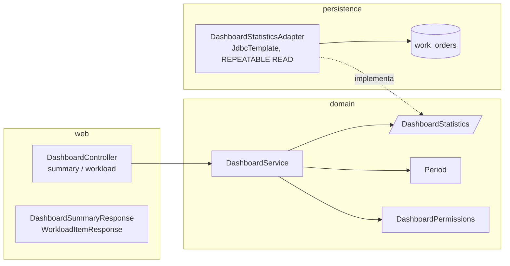
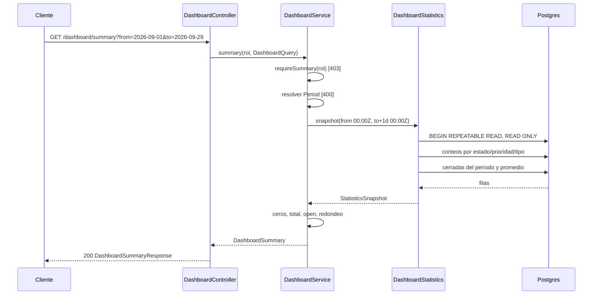

# Spec 05 — Diseño: dashboard, indicadores

## 1. Decisiones técnicas

| Tema | Decisión | Motivo |
|---|---|---|
| Módulo | Nuevo `dashboard` (`web / domain / persistence`), el que ya prevé `steering/structure.md`. Sin tablas ni migraciones: todo se calcula sobre `work_orders` | REQ-1, REQ-15. ROADMAP: "solo lecturas agregadas sobre `work_orders`" |
| Cómo se lee `work_orders` | `DashboardStatisticsAdapter` (en `dashboard/persistence`) usa `JdbcTemplate` con SQL de agregación de solo lectura. **No** usa `WorkOrderEntity` ni `WorkOrderJpaRepository` (son paquete-privados de `workorders`) ni agrega métodos de agregación al puerto `WorkOrderRepository` | Un `GROUP BY` es una consulta de lectura, no una entidad. Evita traer 32 o 32 000 órdenes a memoria para contarlas y no ensucia el puerto de la spec 03/04. El costo: el módulo conoce los nombres de columna de `work_orders` (queda en una sola clase, probada contra la base real). Alternativa descartada: una `@Query` en `WorkOrderJpaRepository`, que obligaría a abrir esa interfaz a otro módulo |
| Enums | `dashboard.domain` importa `WorkOrderStatus`, `Priority` y `WorkOrderType` de `workorders.domain` para el orden y los nombres de las claves | Una sola fuente de los valores kebab-case. `workorders` no importa `dashboard`: no hay ciclo |
| Decisión en `domain` | `DashboardService` valida el período, arma los ceros y suma `total` y `open`; el adaptador solo devuelve filas agregadas. `DashboardPermissions` decide el rol | `CLAUDE.md`: la autorización y las reglas viven en `domain`. Con las reglas fuera del SQL se prueban con Mockito sin base |
| Rol | Se toma del claim `role` del token (`AuthenticatedRole`), como en la spec 03. No se lee al usuario de la base | Son lecturas: no hacen falta `id` ni `displayName`, a diferencia de las transiciones de la spec 04 |
| Consistencia | Una sola llamada al puerto, `snapshot(from, toExclusive)`, que corre **dos** consultas en una transacción `REPEATABLE READ` de solo lectura | REQ-6 pide números exactos. Así `byStatus`, `byPriority`, `byType` y `closedInPeriod` salen de la misma foto de la base, aunque una transición ocurra en el medio |
| Conteos | **Una** consulta: `select status, priority, type, count(*) from work_orders group by status, priority, type`. El dominio suma por cada eje, así `byStatus`, `byPriority`, `byType` y `total` coinciden entre sí por construcción | REQ-2 a REQ-6. Una consulta por eje podría dar totales distintos |
| Cerradas y promedio | **Una** consulta: `select status, count(*), avg(extract(epoch from closed_at - created_at)) / 60 from work_orders where status in ('completed','cancelled') and closed_at >= :from and closed_at < :toExclusive group by status`. El promedio solo se lee de la fila `completed` | REQ-7, REQ-11, REQ-12. `closed_at` es `closingNote.at` (spec 04, `V8` garantiza que una cerrada lo tiene) |
| Período | `from` y `to` son `LocalDate` UTC. El SQL recibe `from` a las `00:00:00Z` (incluido) y `to + 1 día` a las `00:00:00Z` (excluido): cuenta los dos días completos | REQ-7. Evita el error clásico de `<= to 00:00` |
| Redondeo | En `domain`: `BigDecimal.setScale(1, HALF_UP)` sobre el promedio en minutos que devuelve el adaptador sin redondear. El JSON lo serializa como número (`null` si no hay) | REQ-11, REQ-12. Redondear en SQL y en Java daría dos reglas |
| Reloj | `Clock` inyectado (`ClockConfig`, UTC): "hoy" es `LocalDate.now(clock)` | REQ-8, REQ-9 se prueban con un reloj fijo |
| Parámetros | `from` y `to` llegan como `String` y los valida `domain` (formato `\d{4}-\d{2}-\d{2}` estricto, `LocalDate.parse`; vacío es inválido, como `page` en la spec 03). Todos los errores juntos en un `ValidationFailedException` | REQ-10. Un `LocalDate` en la firma del controller daría el `400` genérico de Spring sin el detalle por parámetro |
| Orden de errores | `401 → 403 → 400` | `workload` no tiene parámetros; en `summary` ningún rol es rechazado, así que solo hay `401 → 400` |
| Carga por técnico | Se agrupa por `taken_by_id` entre las `in-progress`. El nombre es el `taken_by_name` de la toma **más reciente** (`(array_agg(taken_by_name order by taken_at desc))[1]`), porque la orden guarda una foto del nombre que puede haber cambiado entre tomas. El orden (cantidad descendente, nombre ascendente sin distinguir mayúsculas) lo aplica `domain` | REQ-15, REQ-16. El orden en Java no depende de la colación de la base |
| Sin caché | No hay `@Cacheable` ni cabeceras de caché. Cada llamada consulta la base | REQ-14 |
| Índices | Sin migración y sin índices nuevos. Con el volumen del proyecto un recorrido de `work_orders` es suficiente | Se deja para la spec 06 (operación), como pide el ROADMAP |
| OpenAPI | `@Operation` y `@ApiResponse` en los dos métodos; `@SecurityRequirement(bearerAuth)` en la clase | REQ-20 |
| Errores | Sin handlers nuevos | Los `code` no cambian |

## 2. Contrato HTTP

| Método y ruta | Roles | Parámetros | Éxito | Errores propios |
|---|---|---|---|---|
| `GET /dashboard/summary` | cualquier usuario autenticado | `from`, `to` (opcionales, `YYYY-MM-DD`) | `200` | `400 VALIDATION_ERROR` |
| `GET /dashboard/workload` | administrador, team leader | ninguno | `200` | `403` |

Ambos devuelven `401` sin token, en el `ApiError` de la spec 00.

`summary` responde la forma fijada en `requirements.md`. Las claves de `byStatus`, `byPriority` y `byType` salen siempre, en el orden de los enums (`pending`, `in-progress`, `completed`, `cancelled`; `low`, `medium`, `high`; `preventivo`, `correctivo`, `pronto-intervencion`), con `0` si no hay órdenes. `averageResolutionMinutes` es `null` explícito (no se omite) cuando no hay órdenes `completed` cerradas en el período.

`workload` responde un **arreglo JSON** (no un objeto con `data`: no está paginado). **Decisión mía:** el nombre del campo de la cantidad es `inProgress`, que los requisitos no fijaron:

```json
[
  { "takenById": "5", "takenByName": "Técnico Electricista Preventivo", "inProgress": 5 },
  { "takenById": "4", "takenByName": "Técnico Mecánico de Guardia", "inProgress": 4 }
]
```

`takenById` es el id de usuario como string, igual que `takenBy.id` de la orden.

## 3. Componentes por capa



```
com.enterpriselab.api
└── dashboard/
    ├── web/          DashboardController, DashboardSummaryResponse, PeriodResponse,
    │                 ClosedInPeriodResponse, WorkloadItemResponse
    ├── domain/       DashboardService, DashboardPermissions, DashboardQuery (from, to crudos),
    │                 Period, DashboardSummary, ClosedInPeriod, WorkloadItem,
    │                 DashboardStatistics (puerto), StatisticsSnapshot, OrderCount,
    │                 ClosedStats, OwnerLoad
    └── persistence/  DashboardStatisticsAdapter
```

**Dominio**

- `DashboardPermissions`: `requireSummary(rol)` (los cuatro roles; un rol `null` es `403`) y `requireWorkload(rol)` (administrador y team leader).
- `Period(LocalDate from, LocalDate to)`: la resuelve `DashboardService` (§4.1) y expone `fromInstant()` y `toExclusiveInstant()`.
- Puerto `DashboardStatistics`:

  ```java
  StatisticsSnapshot snapshot(Instant fromInclusive, Instant toExclusive);
  List<OwnerLoad> inProgressByOwner();

  record StatisticsSnapshot(List<OrderCount> counts, ClosedStats closed) {}
  record OrderCount(WorkOrderStatus status, Priority priority, WorkOrderType type, long count) {}
  record ClosedStats(long completed, long cancelled, BigDecimal averageResolutionMinutes) {} // promedio sin redondear, null si no hay
  record OwnerLoad(long takenById, String takenByName, long count) {}
  ```

- `DashboardService(DashboardStatistics, Clock)`: `summary(rol, DashboardQuery)` y `workload(rol)`.

**Persistencia**

- `DashboardStatisticsAdapter.snapshot` está anotado `@Transactional(readOnly = true, isolation = REPEATABLE_READ)` y corre las dos consultas de §1. `inProgressByOwner` corre `select taken_by_id, (array_agg(taken_by_name order by taken_at desc))[1], count(*) from work_orders where status = 'in-progress' group by taken_by_id`.
- El adaptador convierte las cadenas de la base con `fromValue` de cada enum; un valor desconocido es un dato corrupto y llega como `500` sin filtrar detalles (los `CHECK` de `V7` lo impiden).

**Web**

- `DashboardController` solo extrae el rol del token (`AuthenticatedRole`) y pasa los parámetros crudos al servicio. `SecurityConfig` no cambia: `anyRequest().authenticated()` ya cubre `/dashboard/**`.

## 4. Reglas de dominio

### 4.1 Período (REQ-7 a REQ-10)

| `from` | `to` | Resultado |
|---|---|---|
| ausente | ausente | `to` = hoy (UTC), `from` = `to − 29 días` (REQ-8) |
| dado | ausente | `to` = hoy |
| ausente | dado | `from` = `to − 29 días` (REQ-9) |
| dado | dado | los dos tal cual |

- Un valor presente que no cumple `\d{4}-\d{2}-\d{2}` o no es una fecha real (`2026-02-30`, `2026-13-01`) es error del parámetro: `"Debe ser una fecha con formato YYYY-MM-DD"`. Vacío (`?from=`) también.
- Si los dos son válidos y `from` es posterior a `to` (incluye un `from` futuro con `to` por defecto): error en `from`: `"No puede ser posterior a to"`. Los errores de formato de ambos parámetros se informan juntos; el de orden solo si los dos formatos son válidos.
- El período devuelto en `period` es el ya completado.

### 4.2 Resumen

- `byStatus`, `byPriority` y `byType`: para cada valor del enum, la suma de `OrderCount.count` con ese valor, `0` si no hay filas (REQ-2 a REQ-4, REQ-13).
- `total` = suma de todas las filas; `open` = `pending` + `in-progress` (REQ-5).
- `closedInPeriod.completed` y `.cancelled` salen de `ClosedStats`; `total` es su suma (REQ-7).
- `averageResolutionMinutes` = `ClosedStats.averageResolutionMinutes` redondeado a un decimal, o `null` (REQ-11, REQ-12). Una cancelada no entra: la consulta solo promedia la fila `completed`.

### 4.3 Carga de trabajo

`DashboardService.workload` ordena `OwnerLoad` por `count` descendente y, a igual cantidad, por `takenByName` ascendente sin distinguir mayúsculas, y desempata por `takenById` para que el orden sea determinista (REQ-16). Lista vacía si no hay `in-progress` (REQ-17).



## 5. Estrategia de pruebas

El contenedor Postgres se comparte con el resto de las IT, que limpian lo que crean pero dejan las 32 órdenes del seed. Por eso:

- **Cifras exactas** (período, promedio, vacío): `DashboardStatisticsAdapterIT` crea una **base propia** (como `WorkOrdersUpgradeIT`), migra con `db/migration` (y, en un caso, con el seed), arma el adaptador con un `JdbcTemplate` sobre esa base e inserta por SQL órdenes con `created_at` y `closed_at` controlados.
- **HTTP** (`DashboardControllerIT`, perfil `dev`): no afirma sobre totales absolutos sino sobre diferencias contra la propia consulta previa, y compara `summary` con `GET /work-orders?...` en el mismo instante.
- Las reglas (período, ceros, redondeo, orden) se prueban con Mockito en `DashboardServiceTest`, con `Clock` fijo.

| Requisito | Prueba |
|---|---|
| REQ-1 | `DashboardControllerIT`: `200` con las claves `period`, `byStatus`, `byPriority`, `byType`, `total`, `open`, `closedInPeriod` y `averageResolutionMinutes` |
| REQ-2, 3, 4 | `DashboardServiceTest`: ceros para los valores sin órdenes, claves en el orden del enum. `DashboardStatisticsAdapterIT`: conteos por combinación contra órdenes insertadas |
| REQ-5 | `DashboardServiceTest` (`total` y `open`); `DashboardControllerIT` (`total` ≥ 32 y `open` = `pending` + `in-progress`) |
| REQ-6 | `DashboardControllerIT`: el valor de cada estado y prioridad es igual al `totalItems` de `GET /work-orders?status=` y `?priority=` (sin transiciones en el medio) |
| REQ-7 | `DashboardStatisticsAdapterIT`: órdenes cerradas el día `from` a las `00:00:00Z`, el día `to` a las `23:59:59.999Z`, el día anterior y el posterior; `completed` y `cancelled` por separado; `DashboardControllerIT`: cerrar una orden y ver `closedInPeriod` subir |
| REQ-8 | `DashboardServiceTest` (reloj fijo): período por defecto de 30 días con `from` = hoy − 29; `DashboardControllerIT`: `period.to` = hoy |
| REQ-9 | `DashboardServiceTest`: solo `from`, solo `to` |
| REQ-10 | `DashboardServiceTest` y `DashboardControllerIT`: `2026-9-1`, `2026-02-30`, `abc`, vacío, `+20260-01-01`, `from` > `to`, `from` futuro con `to` por defecto → `400` con el parámetro; los dos mal → los dos en `details` |
| REQ-11 | `DashboardServiceTest` (redondeo `HALF_UP` a un decimal); `DashboardStatisticsAdapterIT`: dos `completed` con duraciones conocidas, una `cancelled` y una `completed` fuera del período que no entran; con el seed y un período amplio el promedio no es negativo |
| REQ-12 | `DashboardStatisticsAdapterIT` y `DashboardServiceTest`: período sin `completed` (solo `cancelled`) → `null` |
| REQ-13 | `DashboardStatisticsAdapterIT` (base propia sin seed, vacía) y `DashboardServiceTest`: todo en `0` y promedio `null` |
| REQ-14 | `DashboardControllerIT`: `take`, `close` y `release` por la API y el resumen cambia en la consulta siguiente |
| REQ-15, 16 | `DashboardStatisticsAdapterIT`: dos técnicos con distinta cantidad, y el nombre de la toma más reciente; `DashboardServiceTest`: orden por cantidad, nombre y `takenById`; `DashboardControllerIT`: la forma `{takenById, takenByName, inProgress}` |
| REQ-17 | `DashboardStatisticsAdapterIT` (base vacía) y `DashboardServiceTest`: lista vacía |
| REQ-18 | `DashboardPermissionsTest` (4 roles); `DashboardControllerIT`: los cuatro roles reciben `200`; sin token → `401` |
| REQ-19 | `DashboardPermissionsTest`; `DashboardControllerIT`: `produccion` y `tecnico` → `403`; sin token → `401` |
| REQ-20 | `OpenApiIT` (se amplía): `/v3/api-docs` contiene `/dashboard/summary` (con los parámetros `from` y `to`) y `/dashboard/workload`, ambos con `get`, `bearerAuth`, `401` y, el segundo, `403` |

Además: `DashboardControllerIT` verifica el orden `401 → 400` y que `workload` ignora parámetros inesperados.

## 6. Puntos que decidí yo y reglas que los requisitos no cubren

Decisiones a confirmar al aprobar:

1. **El módulo lee `work_orders` con `JdbcTemplate` y SQL propio** (§1), en vez de pasar por el puerto de órdenes. Costo: conoce los nombres de columna; beneficio: no carga filas ni abre las clases internas de `workorders`.
2. **`summary` corre en una transacción `REPEATABLE READ` de solo lectura** con dos consultas, para que `closedInPeriod` y los conteos salgan de la misma foto (REQ-6). Alternativa descartada: `READ COMMITTED` por defecto; es más simple, pero dos consultas podrían ver estados distintos.
3. **El campo de la cantidad en `workload` se llama `inProgress`** (§2) y la respuesta es un arreglo, no `{data, ...}`.
4. **El nombre del técnico en `workload` es el de su toma más reciente**, no el actual de `users` (§1): es la misma foto que ya muestra la orden.
5. **Orden por nombre sin distinguir mayúsculas y con desempate por `takenById`** (§4.3): los requisitos solo dicen "ascendente".
6. **`from` futuro con `to` por defecto es `400`**, igual que cualquier `from` posterior a `to` (§4.1).
7. **El rol se toma del claim del token**, no de la base (§1).
8. **Sin índices ni migración** (§1): se deja para la spec 06.

No se agregan requisitos: todo lo que apareció al diseñar ya estaba cubierto por REQ-1 a REQ-20.

## 7. Trazabilidad

| REQ | Sección |
|---|---|
| 1 | §2, §3 (web) |
| 2, 3, 4, 5 | §1 (conteos), §4.2 |
| 6 | §1 (consistencia, conteos), §6 punto 2 |
| 7 | §1 (período, cerradas y promedio), §4.2 |
| 8, 9, 10 | §1 (reloj, parámetros), §4.1 |
| 11, 12 | §1 (cerradas y promedio, redondeo), §4.2 |
| 13 | §4.2 (ceros) |
| 14 | §1 (sin caché) |
| 15, 16, 17 | §1 (carga por técnico), §2, §4.3 |
| 18, 19 | §1 (rol, orden de errores), §3 (`DashboardPermissions`) |
| 20 | §1 (OpenAPI) |
