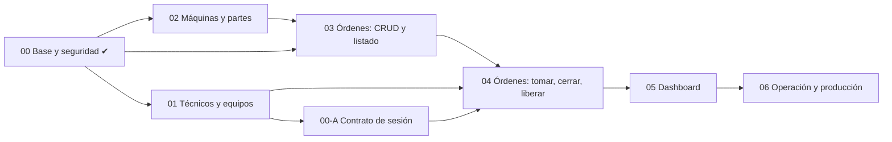

# Roadmap de specs — angular-enterprise-lab-api

**Estado:** Decisiones de reparto tomadas el 2026-09-29 (ver §4). Falta aprobar
los `requirements.md` de cada spec, de a una.

Objetivo: cubrir la totalidad de las funcionalidades de `angular-enterprise-lab`
(frontend) con un backend real, dividido en módulos y specs incrementales. Cada
spec sigue el flujo completo (`requirements.md` → `design.md` → `tasks.md`, con
aprobación entre fases, ver `CLAUDE.md`).

Fuentes usadas: README y `CLAUDE.md` del frontend, sus specs 001–013d
(`.claude/specs/`), los modelos, políticas de permisos y servicios de cada
feature, y `db.json`.

## 1. Inventario del frontend

| Feature (frontend) | Colecciones en JSON Server | Qué hace hoy | Reglas que hoy solo vigila el cliente |
|---|---|---|---|
| `auth` + `core/auth` | `users` | Login simulado, sesión, 4 roles | Credenciales, perfil del técnico (legajo → especialidad y tipo de equipo) |
| `maintenance` | `tecnicos`, `equipos` | Maestro de técnicos y equipos, alta de miembros por legajo | Legajo único e inmutable; no borrar técnico con login o en un equipo; equipos solo del team leader |
| `machines` | `maquinas`, `partes` | Maestro de máquinas y árbol de partes de profundidad variable | Código único normalizado; no borrar máquina con partes ni parte con hijos; padre de la misma máquina; `machineId`/`parentId` inmutables |
| `work-orders` | `work-orders` | Listado con búsqueda, paginación y filtros; alta, edición, baja; tomar, cerrar, liberar | Crear por rol y tipo; editar/eliminar por rol; tipo y máquina inmutables al editar; transiciones de estado; comentario de cierre de 50 a 500 caracteres; dueño de la orden |
| `dashboard` | — | Página vacía, "sin indicadores" | Sin definir todavía (pendiente también en el frontend) |
| `layout`, `shared`, interceptores | — | Solo UI | No requiere backend |

## 2. Módulos del backend

`steering/structure.md` hoy lista `auth`, `workorders`, `maintenance` y
`shared`. El frontend tiene además `machines` (feature propia) y `dashboard`, así
que hay que sumarlos (se actualiza `structure.md` al aprobar este roadmap).

| Módulo (paquete) | Feature frontend | Tablas | Estado |
|---|---|---|---|
| `auth` | `auth`, `core/auth` | `users` | Hecho (spec 00 + enmienda 00-A de sesión) |
| `maintenance` | `maintenance` | `technicians` (se extiende), `teams`, `team_members` | Hecho (spec 01) |
| `machines` | `machines` | `machines`, `parts` | Pendiente |
| `workorders` | `work-orders` | `work_orders` | Pendiente |
| `dashboard` | `dashboard` | (solo lecturas agregadas sobre `work_orders`) | Pendiente, requiere definición de producto |
| `shared` | `core` | — | Hecho: `ApiError`, `RestExceptionHandler`; falta paginación |

## 3. Specs propuestas, en orden de implementación

| # | Spec | Módulo | Depende de |
|---|---|---|---|
| 00 | Proyecto base y seguridad | `auth`, `shared` | — (**hecha**, falta su cierre formal, ver §5) |
| 01 | Técnicos y equipos | `maintenance` | 00 (**hecha**; falta ver el CI en verde en un PR) |
| 00-A | Enmienda: contrato de sesión del frontend | `auth` | 00, 01 (**hecha**; falta ver el CI en verde en el PR) |
| 02 | Máquinas y árbol de partes | `machines` | 00 (puede ir en paralelo con 01) |
| 03 | Órdenes de trabajo: alta, consulta, edición, baja y listado | `workorders` | 00, 02 |
| 04 | Órdenes de trabajo: tomar, cerrar y liberar | `workorders` | 03, 01, 00-A |
| 05 | Dashboard: indicadores | `dashboard` | 03, 04 |
| 06 | Operación y producción (transversal, opcional) | todos | todas |

### 01 — Técnicos y equipos (`maintenance`)

- Técnicos: alta, consulta, edición y baja. `legajo` único, con formato de 1 a 8
  dígitos y no editable; nombre, apellido, especialidad (`mecanico`,
  `electricista`, `general`) y tipo de equipo (`guardia`,
  `preventivo-correctivo`).
- Baja bloqueada (409) si el técnico tiene usuario de login o es miembro de un
  equipo.
- Equipos: alta, consulta, edición y baja, con nombre, tipo y miembros (legajos
  existentes, sin repetidos).
- Permisos: técnicos, ver/crear/modificar → administrador y team leader,
  eliminar → administrador; equipos → solo team leader.
- Extiende la tabla `technicians` de la spec 00 y migra el seed de dev (legajos
  1001, 1002 y 1003; dos equipos).

### 02 — Máquinas y árbol de partes (`machines`)

- Máquinas: `code` único normalizado (trim + mayúsculas, hasta 20 caracteres de
  letras, dígitos y guiones, sin empezar con guion) y `name`. Baja bloqueada
  (409) si tiene partes.
- Partes: lista de adyacencia (`machineId`, `parentId`). El padre debe existir y
  ser de la misma máquina; `machineId` y `parentId` no cambian; al editar solo
  cambia el nombre; baja bloqueada (409) si tiene sub-partes; consulta por
  máquina.
- Permisos: escritura → administrador y team leader. **Lectura → cualquier usuario
  autenticado** (producción y team leader eligen máquina y parte al crear una
  orden, aunque no gestionen el maestro).
- Seed de dev: Envasadora (4 niveles), Selladora (2), Rotuladora (sin partes).

### 03 — Órdenes de trabajo: CRUD y listado (`workorders`)

- Listado paginado con búsqueda por título y filtros por estado y prioridad;
  visible para todo usuario autenticado.
- Alta según rol y tipo: team leader → `preventivo`, `correctivo`; producción →
  `pronto-intervencion`; administrador y técnico no crean. Estado inicial
  `pending`; `createdAt` lo pone el servidor.
- Referencia a máquina y parte obligatoria para los tres tipos; el servidor
  arma el `breadcrumb` (snapshot que no cambia si luego se renombra la parte) y,
  si la cadena no se resuelve, no crea la orden.
- Edición → administrador y team leader; **el tipo y la referencia a máquina no
  cambian**, y el estado, el dueño y el cierre no se tocan por esta vía.
  Baja → administrador.
- Seed de dev: las órdenes de `db.json` (incluye en progreso y cerradas).

### 04 — Órdenes de trabajo: tomar, cerrar y liberar (`workorders`)

- Tomar: técnico cuyo tipo de equipo atiende el tipo de la orden (`guardia` →
  `pronto-intervencion`; `preventivo-correctivo` → `preventivo`, `correctivo`),
  solo sobre una orden `pending`, con actualización condicional atómica: si otro
  se adelantó, 409 con el dueño y el estado actuales.
- Cerrar: solo el dueño, sobre una orden `in-progress`, con resultado
  `completed` o `cancelled` y comentario de 50 a 500 caracteres (sin contar
  espacios de los bordes). Una orden cerrada no se reabre.
- Liberar: administrador y team leader, sobre una orden `in-progress`; vuelve a
  `pending` sin dueño (sin historial).
- Invariantes: `pending` sin dueño; `in-progress` con dueño; cerrada con dueño y
  nota de cierre cuyo autor es el dueño.
- La especialidad de la orden no se evalúa (las órdenes todavía no la llevan).

### 05 — Dashboard (`dashboard`)

Propuesta a validar, porque el frontend todavía no define los indicadores:
órdenes por estado, por prioridad y por tipo; abiertas (`pending` +
`in-progress`); cerradas en un período; tiempo promedio de cierre; en progreso
por técnico.

### 06 — Operación y producción (opcional)

Imagen y servicio Docker para `web-stack-infrastructure`, decisión de refresh
tokens (pendiente en `design.md` §8 de la spec 00), endurecimiento de producción
(springdoc apagado, `JWT_SECRET` obligatorio, CORS de producción), índices y
observabilidad.

## 4. Decisiones transversales

| # | Decisión | Recomendación |
|---|---|---|
| D1 | Contrato de API | **Decidido: REST limpio en inglés** (`steering/tech.md` permitía este cambio si una spec lo decide explícitamente). Rutas `/technicians`, `/teams`, `/machines`, `/parts`, `/work-orders`, `/auth/login`. Paginación con `page` (desde 1) y `size`, filtros con el nombre del campo (`title`, `status`, `priority`) y respuesta `{data, page, size, totalItems, totalPages}`; el formato exacto se cierra en el `requirements.md` de la spec 03. El frontend tendrá que adaptar sus servicios (su "spec 018"), con `PaginatedResponse` incluido. |
| D2 | Ids | Se serializan como **string** (el frontend los tipa así y JSON Server los devolvía así), aunque en Postgres sean `BIGSERIAL`. |
| D3 | Snapshots | El servidor arma `breadcrumb`, `takenBy.name` y `closingNote.authorName` (autoridad real, no el cliente). |
| D4 | Transiciones de estado | Acciones dedicadas `POST /work-orders/{id}/take`, `/close`, `/release` con actualización condicional; en la spec 03 el `PUT` no puede cambiar estado ni dueño. En el frontend solo cambian 3 métodos de `WorkOrdersService`. |
| D5 | Integridad referencial | FK e índices únicos en base; los bloqueos de baja responden 409 con un `code` específico (mismo `ApiError` de la spec 00). |
| D6 | Autorización | En `domain` (servicios), migrando la matriz de los `*.permissions.ts` del frontend, con un test por rol y acción (regla de `CLAUDE.md`). |
| D7 | Datos de dev | Seed Flyway solo en el perfil `dev`, replicando `db.json` (como en la spec 00). |
| D8 | Paginación | Solo el listado de órdenes se pagina; técnicos, equipos, máquinas y partes devuelven la colección completa, como hoy. |

## 5. Brechas detectadas en la spec 00

Las brechas 1 a 4 las resolvió la enmienda 00-A (hecha el 2026-09-30); queda
pendiente la 5. Se dejan como estaban escritas, para el historial:

1. `LoginResponse` es `{token}`; el frontend espera `{token, user}`, donde
   `user` lleva `id`, `username`, `displayName`, `email`, `role` y, para técnicos,
   `legajo`, `specialty` y `teamType` (sin ellos `isAuthUser` invalida la
   sesión).
2. `MeResponse` es `{username, role, legajo}`: le faltan los mismos campos.
3. `users` no tiene `display_name` ni `email`.
4. La especialidad y el tipo de equipo viven en el maestro de técnicos, que la
   spec 00 dejó mínimo (solo `legajo`): la enmienda 00-A depende de la spec 01.
5. **Cierre formal pendiente:** el flujo SDD pide recorrer los REQ-1 a REQ-14 uno
   por uno con su evidencia antes de dar la spec por cerrada. Las 22 tareas están
   tildadas, pero ese recorrido no se hizo.

## 6. Fuera de alcance del backend

- Asignar una orden a un técnico concreto (pendiente también en el roadmap del
  frontend).
- Alta y gestión de usuarios: ninguna pantalla usa `UsersService.create`; solo
  se usa `hasTechnicianAccount` (para bloquear la baja de un técnico).
- Recuperación de contraseña, notificaciones y multi-tenant.
- La migración del frontend a esta API (la "spec 018" del frontend): vive en
  ese repo.

## 7. Próximos pasos

Decisiones tomadas el 2026-09-29: contrato REST limpio en inglés (D1), órdenes
en dos specs (03 y 04), dashboard incluido con la propuesta de §3, y la sesión
resuelta como enmienda a la spec 00 (00-A) después de la 01. D2–D8 quedan como
están escritas, salvo objeción al revisar cada `requirements.md`.

1. ~~Actualizar `steering/structure.md` con los módulos `machines` y `dashboard`.~~
   Hecho.
2. Spec 01 (técnicos y equipos) y enmienda 00-A (contrato de sesión): aprobadas e
   implementadas (2026-09-30). `requirements.md` escritos, **pendientes de
   aprobación**: 02 (máquinas y partes), 03 (órdenes: CRUD y listado), 04
   (órdenes: tomar, cerrar y liberar) y 05 (dashboard, propuesta mía a validar).
3. Sin escribir todavía: la spec 06 (operación y producción, opcional) y el cierre
   formal de la spec 00 (recorrer REQ-1 a REQ-14 con evidencia).
4. Con los requisitos aprobados, seguir con `design.md` y `tasks.md` de cada spec,
   en el orden de §3 (02, 03, 04, 05; la 01 y la 00-A ya están hechas). Numeración
   de migraciones: la 01 usa `V2`, `V2_1` (seed) y `V3`; la 00-A usa `V4`, `V4_1`
   (seed) y `V5`; las siguientes empiezan en `V6`.
